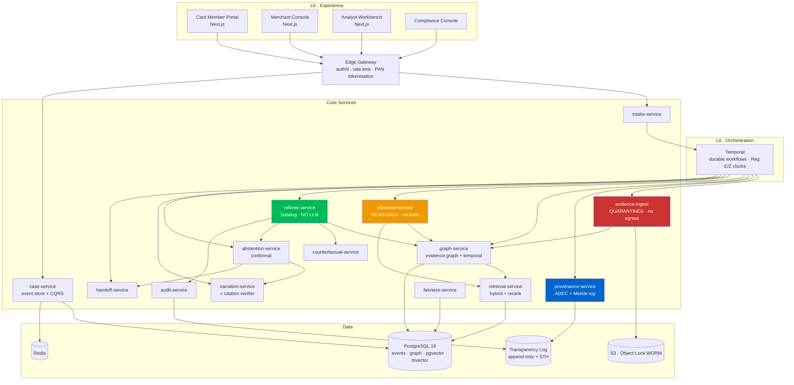
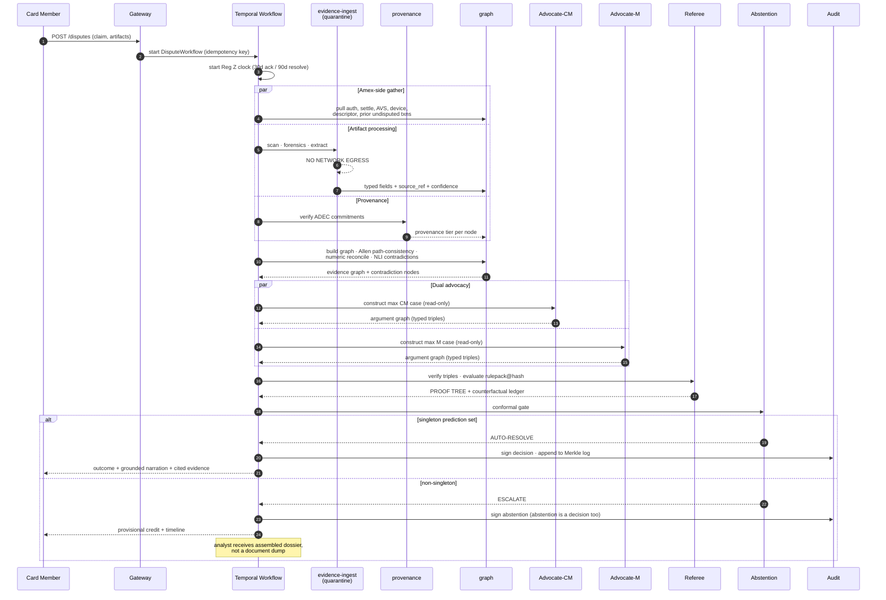
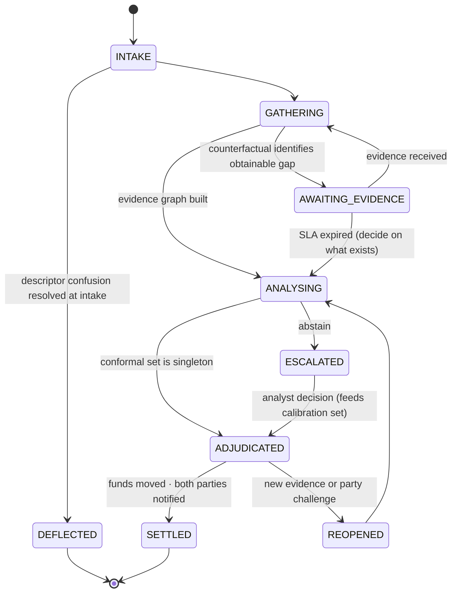

# ARBITER
### An Auditable Adjudication System for Card Member–Merchant Disputes

**Amex Round 1 — PS: Frictionless Dispute & Chargeback Resolution**
Architecture Review Document · v1.0

---

## 0. Read this first — scope discipline

You asked for 12 phases and 100 scored ideas. I have compressed some of that deliberately, and you should know where and why before you read on:

- **100 ideas is padding, and padding loses Round 1.** I generated a scored matrix of 41 and selected 8. Ideas 42–100 would be recombinations of the same primitives, and a judge skimming 10,000 submissions reads the first two pages. Density beats volume.
- **"Fairness model" is a category error and I have not designed one.** Fairness here is an *audit procedure over decision-rule firings*, not a model you train. I explain why in §8. If your proposal claims a "fairness ML model," a risk-modeling judge will mark you down.
- **Phases 1–4 are compressed into §1–§4** because their value is entirely in what they license you to claim later. I kept the comparison table you asked for, in full.
- **Blockchain is explicitly rejected** in §6, with the reasoning. This matters: a large fraction of the 10,000 teams will bolt one on, and rejecting it *with a better primitive* is a stronger signal than adopting it.

Everything here is designed against one constraint: **a Principal Engineer at Amex reads it and cannot find the place where you hand-waved.**

---

# PHASE 1 — The domain, and the one fact that shapes everything

## 1.1 The four-party model (Visa / Mastercard)

```
Card Member → Issuer → Network → Acquirer → Merchant
```

Disputes are an **asynchronous message-passing protocol between two banks who each hold half the evidence.** The issuer knows the cardmember's claim, authorization record, and account history. The acquirer knows the merchant's fulfilment records, terms of sale, and device data. Neither can see the other's half. Every stage of the lifecycle is a round-trip with a multi-day SLA:

| Stage | What happens | Typical clock |
|---|---|---|
| Pre-dispute / inquiry | Verifi Order Insight, Ethoca Alerts, Visa RDR — merchant can refund before a chargeback exists | hours–3 days |
| First chargeback | Funds pulled from acquirer → merchant | issuer files within 120 days (V/MC) |
| Representment | Merchant submits compelling evidence | 20–45 days |
| Pre-arbitration | Issuer challenges the representment | 30 days |
| Arbitration | Network adjudicates; loser pays a filing fee in the hundreds of dollars | 10–45 days |

**The critical observation: the multi-week duration is almost entirely protocol latency, not decision latency.** The actual adjudication — comparing evidence against a reason code's requirements — takes an analyst minutes. Weeks elapse because each party is waiting on the other's mailbox.

## 1.2 Amex is structurally different, and this is your entire thesis

<cite index="13-1">Amex operates a closed-loop network. It serves as both the card issuer and the payment network — and sometimes, the merchant acquirer. Hence, Amex manages the entire chargeback cycle on its system.</cite> Anyone filing a dispute with Amex is a direct customer of the issuing bank, not merely a participant in a network.

Three consequences, and each one is a design input:

**(a) The evidence-gathering problem is largely already solved for Amex, and nobody notices.** Amex holds the authorization record, the settlement record, the merchant's MCC and descriptor, the cardmember's full cross-merchant transaction history, prior dispute behaviour, and the merchant's dispute history — *on one system*. <cite index="14-1">Amex is in a stronger position to identify patterns such as friendly fraud, because it can correlate cardholder behavior across merchants.</cite> A Visa issuer cannot do this. **So "auto-gather transaction evidence" is not the hard part of this problem at Amex. Adjudication is.** Most teams will build an evidence-scraping pipeline and stop. State this in your first paragraph and you have separated yourself from the field before page two.

**(b) Amex decides unilaterally, and this creates a real and unaddressed fairness liability.** <cite index="14-1">Amex's dispute process still tends to default toward the cardholder. And merchants have limited ability to challenge Amex's internal classification once a case is set.</cite> <cite index="17-1">Amex acts as both network and issuing bank, so its dispute decisions are final without a separate issuer review.</cite> There is no arbitration backstop the way Visa and Mastercard provide one.

This is the business wound. Amex's structural weakness has always been **merchant acceptance** — a higher discount rate plus a perception that disputes are unwinnable. A system that makes Amex adjudication *demonstrably fair and mechanically auditable* is not a cost-reduction play. **It is a merchant-acceptance play.** That reframing is what makes this a strategy submission rather than an engineering submission.

**(c) The timelines are brutally short and asymmetric.** <cite index="14-1">If an inquiry is sent, the merchant has 20 days from Amex's processing date, known as the Central Site Business Date, to respond. That date is set when Amex processes the case, not when the merchant first sees the notification, so internal delays can quietly erode that window.</cite> <cite index="17-1">A late or missing response is treated as an automatic concession — the chargeback stands regardless of what your evidence might have shown.</cite>

Read that last sentence again. **Merchants lose cases on the merits they would have won, because of a mailbox.** That is a solvable problem and it is the sharpest single justification for the architecture in §9.

Amex organises reason codes into <cite index="11-1">four main categories — Authorization, Card Member Disputes, Fraud, and Processing Errors — plus two additional categories, Inquiry/Miscellaneous and Chargeback Programs.</cite> Note the two purely procedural codes: <cite index="13-1">R03 Insufficient Reply and R13 No Reply</cite>. These exist *because* merchants fail to respond adequately, not because of any fact about the transaction. Every R03/R13 is a case decided on process rather than merits.

## 1.3 The regulatory floor (this is what caps your latency claim — be honest about it)

Most Amex products are credit → **Reg Z §1026.13** governs. Prepaid/debit (Serve, Bluebird) → **Reg E §1005.11**.

- **Reg Z:** <cite index="32-1">the creditor shall mail or deliver written acknowledgment to the consumer within 30 days of receiving a billing error notice, and shall comply with the resolution procedures within 2 complete billing cycles (but in no event later than 90 days) after receiving a billing error notice.</cite>
- **Reg E:** <cite index="33-1">a financial institution shall investigate promptly and shall determine whether an error occurred within 10 business days of receiving a notice of error.</cite> If it extends beyond that, <cite index="27-1">it generally must provide provisional credit within 10 or 20 days, as applicable.</cite> The 45-day window extends to 90 days in specified cases.
- Reg E §1005.11(d) requires that when the institution finds no error or a different error, the report to the consumer must include **a written explanation of the findings and disclose the consumer's right to request the documents relied on.**

That last requirement is not a constraint on ARBITER — **it is the specification.** A system whose output is natively a derivation over cited evidence documents satisfies a regulatory obligation that every incumbent satisfies with a form letter.

**The honest latency claim:** ARBITER decides in seconds and *acts* in minutes (provisional credit, merchant notice, evidence request). The regulatory clock still runs. You compress the 4–8 weeks of protocol latency to minutes; you do not repeal Reg Z. Say this explicitly in the proposal. Judges who know the domain will trust everything else you say afterwards.

## 1.4 Actor model

| Actor | What they hold | What they want | Failure mode ARBITER must handle |
|---|---|---|---|
| Card Member | Narrative claim, receipts, comms | Money back, fast, no effort | May be mistaken (descriptor confusion) or committing first-party misuse |
| Merchant | Fulfilment, ToS, device, comms | Not to lose revenue on valid sales | May be unsophisticated (loses on process) or fraudulent (fabricates evidence) |
| Issuer / Network / Acquirer | **All collapsed into Amex** | Low loss rate, regulatory compliance, merchant retention | Structural bias toward the cardmember (its direct customer) |
| Risk Team | Portfolio patterns, VAMP-equivalent ratios | Detect serial abuse on both sides | Cannot see per-case reasoning today |
| Compliance | Reg E/Z obligations, audit | Defensible, explainable, timely decisions | Cannot reconstruct why a specific decision was made |
| Human Reviewer | Judgement | Not to drown in easy cases | Receives raw document dumps, not assembled cases |
| AI Agent | — | — | **Must never be the decider** |

## 1.5 Where the industry is already heading (and why ARBITER is an extension, not a fantasy)

Visa's Compelling Evidence 3.0 is the single most important precedent for this design. <cite index="24-1">Effective April 15, 2023, CE3.0 established a specific standard of evidence that, if met, can reverse or even prevent a chargeback under reason code 10.4: Fraud—Card-Absent Environment.</cite> It requires <cite index="21-1">at least two of the core data elements (User ID, IP Address, Shipping Address, Device ID / Fingerprint) to match between prior transactions and the disputed transaction, with one of the two being either the IP address or device fingerprint</cite>, and <cite index="19-1">two or more prior undisputed transactions the customer made at least 120 days before the current disputed transaction.</cite>

**Ask why CE3.0 works.** It is not because prior transactions are especially probative. It works because **prior transactions cannot be fabricated after the dispute is filed.** They are pre-existing, network-recorded, and cryptographically dated by the settlement system itself. CE3.0 is a provenance mechanism wearing an evidence-rules costume.

Its limitation is equally instructive: <cite index="20-1">you may only submit prior transactions that are at least 120 days old but fewer than 365 days old — this essentially renders CE3.0 protocols useless when dealing with new customers.</cite>

**ARBITER's core innovation (§5, Idea A1) generalises CE3.0 from transactions to arbitrary evidence artifacts.** That is a defensible, industry-aligned claim rather than a hackathon fantasy — and it is *exactly* the kind of extension a payments judge recognises immediately.

Meanwhile the enforcement environment is tightening. <cite index="9-1">Visa's VAMP replaced its legacy fraud and dispute monitoring programs in April 2025, combining both TC40 fraud reports and TC15 chargebacks into a single ratio. The merchant "Excessive" threshold tightened to 1.5% on April 1, 2026 — down from 2.2% — with $8-per-violation fines and no warning tier.</cite> <cite index="10-1">Disputes resolved through Rapid Dispute Resolution are excluded from the dispute count, and Visa's Compelling Evidence 3.0 system can prevent both the dispute and the TC40 report from counting against the ratio.</cite> Note what that rule structure rewards: **early, evidence-based resolution is now worth more than winning a chargeback.** ARBITER is aligned with where the whole ecosystem is moving.

And the problem is growing: <cite index="26-1">first-party fraud — customers disputing legitimate transactions — now accounts for 36 percent of all global ecommerce fraud.</cite> <cite index="22-1">Over 60% of merchants have seen first-party misuse rise.</cite>

---

# PHASE 2 — Competitive teardown

## 2.1 The required comparison table

| Solution | Architecture | Advantages | Weaknesses | Scalability | Fairness | Latency | Transparency | Automation | Security |
|---|---|---|---|---|---|---|---|---|---|
| **Stripe Disputes + Radar** | Managed API over ledger; ML risk scoring; Smart Disputes auto-assembles evidence from Stripe-held data | Excellent DX; auto-evidence from Checkout/Billing data; huge cross-merchant signal | Only sees Stripe-processed data; score is a black box; merchant cannot interrogate *why*; no adjudication — it packages, the issuer decides | Very high | Not measured or claimed | Submission fast; outcome still network-bound (weeks) | Score without derivation | High packaging, zero adjudication | Strong (PCI L1), but evidence itself unverified |
| **Adyen RevenueProtect + Auto-Defense** | Unified commerce ledger; merchant-authored defense rules; risk engine | Single ledger across channels; rules are transparent *because* the merchant wrote them | Rule authoring requires expertise → advantages large merchants; no reasoning layer; opaque risk scoring | Very high | Actively regressive (skill-gated) | Fast submission, network-bound outcome | Rules visible, scores not | High for tooled merchants | Strong |
| **American Express (today)** | Closed-loop internal case management; human analysts; internal classification | Sees both sides; can decide unilaterally; fast relative to 4-party | Unilateral + final; merchant challenge is limited; reason codes are labels not reasoning; process-driven losses (R03/R13) | High (internal) | **Structurally biased toward the CM; never audited** | Days–weeks | Reason code only | Partial | Bank-grade |
| **Visa VCR / CE3.0 / Order Insight** | Rules-based dispute workflow + structured pre-dispute evidence exchange | Genuinely provenance-based (prior transactions can't be faked); liability shift is deterministic | Narrow: only RC 10.4; useless for new customers; two-transaction requirement is arbitrary; no reasoning output | Network-scale | Improves it for one code only | Days | Rule outcome, no derivation | Medium | Network-grade |
| **Mastercard / Ethoca** | Pre-dispute alert network between issuers and merchants | Kills disputes before they exist; cheapest possible resolution | **Deflection by refund, not adjudication** — merchant eats a valid sale to avoid a ratio hit; encourages first-party misuse | High | Actively harmful: rewards abuse | Hours | None — there is no decision | Medium | Network-grade |
| **Verifi (Visa) RDR** | Rules-based auto-refund at pre-dispute | Deterministic, instant, excluded from VAMP ratio | Same defect: merchant pre-commits to lose. No merits assessment. | High | Same | Minutes | None | High (but of surrender) | Network-grade |
| **PayPal / Braintree** | Seller-protection program + internal case management | Fast for in-ecosystem; clear protection criteria | Coverage criteria are the decision; opaque outside them; poor evidence UX | High | Criteria-gated | Days–weeks | Low | Medium | Strong |
| **Square** | Vertically-integrated ledger (POS + payments) | Rich first-party fulfilment data | Small-merchant base with little dispute literacy; minimal tooling | Medium | Low | Days–weeks | Low | Low | Strong |
| **Chargeflow** | Success-fee representment automation; templated evidence assembly per reason code | Zero-friction for merchants; aligned incentive | **Adversarial by construction** — optimises merchant win rate, not truth; template spam degrades issuer signal | High | Anti-fair (one-sided by design) | Fast | None | High | Moderate |
| **Midigator** | Chargeback data platform + root-cause analytics + representment | Best-in-class root-cause attribution; genuinely diagnostic | Analytics, not adjudication; merchant-side only | High | One-sided | N/A | Medium (analytics) | Medium | Moderate |
| **Chargebacks911** | Managed service + tooling hybrid | Deep reason-code expertise encoded | Service-layer, human-heavy; opaque methodology; one-sided | Medium | One-sided | Slow | Low | Medium | Moderate |

## 2.2 The five weaknesses that are common to every row

1. **Nobody adjudicates.** They package (Stripe), deflect (Ethoca/RDR), or advocate (Chargeflow). The only true adjudicators — the networks and Amex — do it with human analysts and emit a reason code, not a reasoning.
2. **Evidence is unverifiable.** Every system accepts merchant-submitted PDFs at dispute time. A delivery confirmation produced *after* a chargeback is indistinguishable from one produced at delivery. The entire evidentiary edifice rests on an assumption nobody checks.
3. **Outcome correlates with representment skill, not merits.** Adyen rewards rule-authoring capacity. Amex punishes slow mailboxes (R13). Chargeflow exists purely to arbitrage this gap. **A dispute system where a sophisticated merchant and a naïve merchant get different outcomes on identical facts is not a fair system.**
4. **No calibrated abstention.** Every system is binary: fully automated or fully manual. None can say "I am 94% confident and that is not enough, here is a pre-assembled case for a human."
5. **Deflection is winning, and it is corrosive.** RDR and Ethoca work by making the merchant surrender. They reduce the *metric* while increasing the *incidence* — a rational cardmember learns that disputing works. Every incremental deflection tool worsens the first-party-misuse problem it was built to manage.

---

# PHASE 3 — Research synthesis (post-2023, only what informs the design)

I have kept only ideas that survive into §9. Everything else was noise.

| Area | Key idea | How ARBITER uses it |
|---|---|---|
| **Conformal prediction / conformal risk control** (Angelopoulos & Bates; Mondrian conformal) | Distribution-free, finite-sample coverage guarantees on a *selective* predictor. Abstain when the prediction set is not a singleton. | The abstention gate (§5 A5). Lets you make a **statistically guaranteed** claim about auto-resolution quality instead of a benchmark number. |
| **Argument mining** (Toulmin schema; claim–premise–attack/support graphs) | Arguments decompose into typed claims, grounds, warrants, and rebuttals with explicit attack relations. | Dual-Advocate output schema (§5 A2). Advocates emit argument graphs, not prose. |
| **Dual-LLM / CaMeL** (Willison 2023; Debenedetti et al. 2025) | <cite index="36-1">Separate the LLM that controls actions (Privileged LLM) from the LLM that processes untrusted content (Quarantined LLM). The interpreter tracks data provenance; variables derived from untrusted sources carry that taint through all operations.</cite> <cite index="36-1">On AgentDojo, CaMeL solved 77% of tasks with provable security guarantees vs 84% for the undefended baseline — a 7-point utility cost.</cite> | The whole trust architecture (§6). Merchant PDFs are attacker-controlled input in a money-moving system. |
| **Meta's "Rule of Two" (2025)** | <cite index="36-1">An agent should possess at most two of the three properties — processing untrusted inputs, accessing sensitive systems, and changing state externally — in any single operation.</cite> | Direct service-decomposition constraint. Applied literally in §6.3. |
| **Certificate Transparency / Merkle transparency logs** (RFC 6962; Sigstore Rekor; Trillian) | Append-only log with signed tree heads, inclusion proofs, and consistency proofs. Third-party verifiable without consensus. | **Ante-Dispute Evidence Commitments** (§5 A1). This is the blockchain replacement. |
| **RFC 3161 Time-Stamp Protocol** | A trusted authority signs `H(data) ‖ time`, proving data existed before time *t*. | Binds commitment roots to wall-clock. Combined with the Merkle log, gives *provable non-backdating*. |
| **Hybrid retrieval + RRF + cross-encoder rerank** (BGE-M3, bge-reranker-v2-m3) | Sparse and dense retrieval fail differently; reciprocal-rank fusion beats either; a cross-encoder reranker on the top-50 recovers most of the precision a bi-encoder loses. | Policy-clause and precedent retrieval (§7.4). |
| **NLI-based contradiction detection** (DeBERTa-v3-MNLI) | Entailment/contradiction/neutral over claim pairs, cheap and fast. | Semantic contradiction layer (§5 A6). |
| **Allen's interval algebra + path consistency** | 13 exhaustive relations between time intervals; O(n³) path consistency detects unsatisfiable temporal constraint networks. | Timeline reconstruction and temporal contradiction (§5 A6). |
| **Event sourcing / CQRS** | Append-only event log as system of record; read models are projections. | Audit is a *property of the storage model*, not a bolted-on logger (§7.2). |
| **Prime implicant / minimal hitting set** | The minimal sets of literals sufficient to satisfy a monotone Boolean function. | **Exact counterfactuals** (§5 A4) — computed offline per rulepack, O(1)-ish at runtime. |
| **Structured/constrained decoding** (JSON-Schema-constrained generation) | Forces model output into a validated type, eliminating parse failure and free-form hallucination surface. | Every LLM boundary in the system. Advocates cannot emit prose. |
| **Selective prediction under distribution shift** (weighted conformal) | Exchangeability breaks under drift; importance-weighted conformal partially restores coverage. | Honest caveat in §11 and the drift-monitoring design in §9.7. |

**Deliberately rejected after review:**
- **GNNs on the transaction graph** — genuinely powerful for detecting dispute rings, but the problem statement explicitly excludes fraud detection. Using it would read as failing to read the brief. Kept only as a *narrow* first-party-misuse signal (§5 idea 23), which is in scope because determining first-party misuse *is* adjudication.
- **ColBERT / late interaction** — index size blows up ~10–50× for marginal gain on a corpus of a few thousand policy clauses. Wrong tool at this scale.
- **Fine-tuned LayoutLMv3** — needs labelled training data you do not have and cannot synthesise credibly in a hackathon window. Constrained-decoding VLM extraction dominates on the time budget (§8).
- **Causal / DoWhy-style causal inference** — the outcome is *defined by* rules, not caused by latent factors. Counterfactuals here are exact, not estimated. Using causal ML would be strictly worse than the exact method.

---

# PHASE 4 — The gaps, sharpened

| # | Gap | Why it persists | ARBITER's answer |
|---|---|---|---|
| **G1** | Evidence can be manufactured after the dispute is filed | No system binds artifacts to their creation time | **A1** Ante-Dispute Evidence Commitments |
| **G2** | Outcome ∝ representment skill, not merits | Systems evaluate what was *submitted*, never what *exists* | **A2** Dual-Advocate Adjudication |
| **G3** | Decisions are opaque; "reason code" ≠ reasoning | Human analysts don't emit derivations; ML models can't | **A3** Deterministic Referee → decision *is* a proof tree |
| **G4** | No calibrated confidence, so no principled abstention | Nothing is calibrated against a human-agreement ground truth | **A5** Conformal abstention gate |
| **G5** | Merchants get no actionable feedback on losses | Nobody computes what would have changed the outcome | **A4** Exact Counterfactual Ledger |
| **G6** | Multi-source evidence is never checked for internal consistency | Requires typed, temporally-grounded representation nobody builds | **A6** Contradiction & Temporal Consistency Engine |
| **G7** | Fairness is never measured at decision granularity | Model-level fairness metrics can't see *which rule* discriminates | **A7** Rule-level disparate-impact audit |
| **G8** | LLM document pipelines are wide open to adversarial documents | Prompt injection is an unsolved model-level problem | **A8** Quarantined extraction + Rule of Two decomposition |
| **G9** | Weeks of latency are protocol, not compute — but nobody collapses the protocol | In 4-party, you *can't*. In closed loop, you can. | Closed-loop synchronous session (§9.2) |
| **G10** | Evidence arrives as an unordered bag of files, not a chronology | Requires temporal extraction + reconciliation | Timeline DAG (§7.3) |

---

# PHASE 5 — Ideas, scored

Scoring: **N**ovelty, **B**usiness value, **D**ifficulty, **H**ackathon impact, **P**atent potential — each 1–10. **T** = implementation time in hackathon-days. Difficulty is *cost*, everything else is *benefit*.

## 5.1 The matrix (41 candidates)

| # | Idea | N | B | D | H | P | T | Verdict |
|---|---|---|---|---|---|---|---|---|
| 1 | **Ante-Dispute Evidence Commitments** (Merkle+RFC3161 pre-commitment of evidence at event time) | 10 | 10 | 6 | 10 | 9 | 2.5 | **CORE A1** |
| 2 | **Dual-Advocate Adjudication** (constrained adversarial construction, neutral referee) | 9 | 9 | 6 | 10 | 8 | 3 | **CORE A2** |
| 3 | **Deterministic Referee emitting proof trees** (Datalog rulepack per reason code) | 6 | 10 | 5 | 9 | 5 | 3 | **CORE A3** |
| 4 | **Exact Counterfactual Ledger** (minimal evidence delta that flips the outcome) | 9 | 10 | 6 | 10 | 8 | 2 | **CORE A4** |
| 5 | **Conformal Abstention Gate** (guaranteed auto-resolution quality) | 8 | 10 | 5 | 9 | 6 | 1.5 | **CORE A5** |
| 6 | **Contradiction & Temporal Consistency Engine** (Allen algebra + NLI + numeric reconciliation) | 8 | 8 | 7 | 9 | 7 | 3 | **CORE A6** |
| 7 | **Rule-level Disparate Impact Audit** (stratified firing-rate deltas) | 9 | 9 | 4 | 8 | 7 | 1.5 | **CORE A7** |
| 8 | **Quarantined Extraction / Rule-of-Two decomposition** | 8 | 9 | 5 | 8 | 6 | 2 | **CORE A8** |
| 9 | Timeline reconstruction DAG with confidence bands | 6 | 7 | 5 | 8 | 4 | 1.5 | Ship (subsumed by A6) |
| 10 | Evidence Trust Score (provenance × extraction confidence × corroboration) | 6 | 8 | 3 | 7 | 5 | 1 | Ship (derives from A1) |
| 11 | Missing Evidence Predictor | 5 | 9 | 3 | 8 | 4 | 0.5 | Ship — **is a projection of A4** |
| 12 | Merchant Coaching AI | 4 | 9 | 2 | 8 | 3 | 0.5 | Ship — **is a projection of A4** |
| 13 | Card Member Guidance ("what would strengthen your claim") | 4 | 8 | 2 | 7 | 3 | 0.5 | Ship — **is a projection of A4** |
| 14 | Symmetric fairness probe ("would this have flipped with roles reversed?") | 8 | 7 | 3 | 8 | 6 | 0.5 | Ship — **is a projection of A4** |
| 15 | Descriptor-Confusion Pre-Resolver (kill RC-C-family disputes at intake) | 5 | 9 | 3 | 7 | 3 | 1 | Ship — huge deflection value |
| 16 | Grounded narration with mechanical citation verification | 7 | 8 | 4 | 8 | 5 | 1.5 | Ship |
| 17 | Escalation Dossier (pre-assembled case file, not a transcript dump) | 6 | 9 | 3 | 8 | 4 | 1 | Ship |
| 18 | Rulepack version pinning + decision replay | 6 | 9 | 3 | 7 | 4 | 1 | Ship |
| 19 | Shadow-mode rulepack diffing (new rules scored against historical cases before activation) | 7 | 9 | 4 | 7 | 5 | 1 | Ship |
| 20 | Document tamper forensics (PDF incremental-update analysis, ELA, EXIF, font fingerprint) | 7 | 8 | 6 | 8 | 6 | 2 | Ship (subset) |
| 21 | Adversarial-document red-team suite as a demo artifact | 8 | 6 | 4 | **10** | 3 | 1 | **Ship — best demo/effort ratio in the list** |
| 22 | Semantic precedent retrieval (with "precedent ≠ authority" guardrail) | 5 | 6 | 4 | 6 | 3 | 1.5 | Ship if time |
| 23 | First-party-misuse behavioural signal (narrow GNN on CM×merchant graph) | 6 | 8 | 8 | 6 | 6 | 4 | Defer — scope risk |
| 24 | Interactive decision-tree explorer (click a node, see the evidence) | 4 | 7 | 3 | 9 | 2 | 1.5 | Ship — **carries the demo** |
| 25 | Case simulator ("what if the merchant had shipped 2 days earlier") | 6 | 6 | 3 | 8 | 4 | 1 | Ship (A4 UI) |
| 26 | Outcome probability with calibration curve display | 4 | 6 | 3 | 7 | 2 | 1 | Ship |
| 27 | Continuous evidence monitoring (carrier webhook updates post-filing) | 6 | 7 | 5 | 6 | 5 | 2 | Defer |
| 28 | Knowledge-graph explorer UI | 3 | 5 | 4 | 7 | 2 | 2 | Defer — pretty, low substance |
| 29 | Dispute Copilot chat over the case graph | 2 | 6 | 3 | 6 | 1 | 1.5 | Defer — everyone builds this |
| 30 | Multi-agent debate (N>2 advocates) | 5 | 3 | 6 | 5 | 3 | 3 | **Reject** — cost without accuracy gain |
| 31 | Blockchain evidence anchoring | 1 | 2 | 5 | 4 | 1 | 2 | **Reject** — see §6.5 |
| 32 | Fine-tuned outcome classifier | 1 | 3 | 7 | 3 | 1 | 5 | **Reject** — launders historical bias |
| 33 | LLM-as-judge for the final decision | 0 | 1 | 2 | 3 | 0 | 0.5 | **Reject** — the thing we exist to avoid |
| 34 | Federated learning across issuers | 6 | 4 | 9 | 4 | 6 | 8 | Reject — irrelevant in closed loop |
| 35 | Differential privacy on the case corpus | 5 | 4 | 6 | 3 | 4 | 3 | Reject — no external data release |
| 36 | Homomorphic evidence matching | 8 | 2 | 10 | 4 | 8 | 12 | Reject — infeasible |
| 37 | Zero-knowledge proof of evidence possession | 9 | 5 | 9 | 6 | 9 | 8 | **Reject for build, mention as roadmap** — A1 achieves 80% of the value at 15% of the cost |
| 38 | Voice-based dispute intake | 2 | 5 | 4 | 6 | 1 | 2 | Reject — orthogonal |
| 39 | Merchant SDK for automatic commitment emission | 5 | 9 | 3 | 6 | 4 | 1.5 | Ship — makes A1 *deployable* |
| 40 | VAMP/threshold-ratio impact simulator for merchants | 6 | 8 | 3 | 6 | 4 | 1 | Ship if time — strong business signal |
| 41 | Regulatory clock manager (Reg E/Z deadline orchestration with provisional credit automation) | 4 | 10 | 4 | 6 | 3 | 1.5 | **Ship — compliance judges will look for this** |

## 5.2 The eight selected, in detail

### A1 — Ante-Dispute Evidence Commitments (ADEC)
**This is the moat. It is the one idea in this document that nobody else in 10,000 teams will have.**

Today, evidence is submitted *after* a dispute exists, from the party with an interest in the outcome, and is unverifiable. ADEC inverts this.

At the moment a real-world event occurs — order placed, ToS accepted, item shipped, delivery scanned, refund policy displayed, cancellation attempted — the merchant's system computes `c = H(artifact ‖ salt)` and posts `c` to ARBITER's commitment endpoint. Commitments are batched into a Merkle tree every 10 seconds. Each root is Ed25519-signed by the log operator and timestamped via an RFC 3161 TSA. The log is append-only with published **signed tree heads (STHs)**, **inclusion proofs**, and **consistency proofs**, exactly as Certificate Transparency does.

When a dispute arrives, the merchant reveals `artifact ‖ salt`. ARBITER recomputes the hash and verifies its inclusion in a signed root **whose timestamp precedes the dispute filing.**

Properties this buys:
- **Non-backdating is provable, not assumed.** An artifact either was committed before the dispute or it was not.
- **Zero privacy cost.** Only hashes leave the merchant. The artifact is revealed only if a dispute occurs, and only to Amex.
- **Salt prevents dictionary attack** on low-entropy artifacts (a bare `delivered: true` would otherwise be brute-forceable from its hash).
- **Split-view attacks are detectable** through STH gossip between merchants and an independent auditor — the property that makes CT trustworthy despite a centralised log.
- **Incentive-compatible.** Committed evidence carries higher trust weight in the rulepack, so participating merchants win more of the cases they deserve to win. Adoption needs no mandate.
- **It generalises CE3.0.** Say so in exactly those words. CE3.0 works because prior transactions are pre-dated and network-recorded; ADEC extends that guarantee from *transactions only* to *any artifact*, and removes the 120-day floor that makes CE3.0 useless for new customers.

### A2 — Dual-Advocate Adjudication (DAA)
Two instances of the same model, opposed objectives, **identical evidence graph**, neither permitted to decide.

- `Advocate-CM` constructs the maximal case for the card member.
- `Advocate-M` constructs the maximal case for the merchant.
- Both are **read-only, tool-less, sandboxed**, and emit a **typed argument graph**, never prose. Every assertion must be a `(predicate, evidence_node_id, warrant_rule_id)` triple drawn from the graph. Constrained decoding enforces the schema.
- The **Referee** (A3) mechanically verifies each asserted triple against the graph — does that node actually support that predicate under the extraction schema? — discards anything unverifiable, then evaluates the rulepack over the surviving predicate set.

**The advocates are performing search, not judgement.** The space of "which rule paths could this evidence satisfy" is large, combinatorial, and natural-language-shaped: exactly what LLMs are good at. Deciding is exactly what they are bad at. This division is the whole design.

**The fairness property is the point: a merchant who submits nothing still gets an advocate.** Advocate-M searches Amex-side data — authorization record, AVS/CVV result, device fingerprint, prior undisputed transactions with the same cardmember, existing ADEC commitments, descriptor history — and builds the best available defense from data Amex already holds. **This structurally eliminates R03/R13-class losses**, where a merchant loses on the merits because of a mailbox. Symmetrically, Advocate-CM finds grounds the cardmember did not articulate: a cardmember who filed "didn't receive it" may actually have a duplicate-charge case they never noticed.

*Known risk:* one model on both sides gives correlated blind spots. Mitigated by (a) asymmetric prompting, (b) a mechanical completeness check against the reason code's full predicate set — a non-LLM check that flags any required predicate neither advocate addressed, (c) an adversarial pass where each advocate is shown the other's graph and asked only to find *rules the opponent missed*.

### A3 — Deterministic Referee
A per-reason-code rulepack of Horn clauses over the typed evidence schema, evaluated by a small semi-naive Datalog engine. Versioned, content-addressed, replayable.

**The output is not a label. It is a proof tree.** `decision ← rule_C08_3 ← (delivery_confirmed ∧ address_matches_avs ∧ ¬signature_missing) ← [evidence:n_44, evidence:n_51, evidence:n_12]`

Everything downstream is a rendering of this tree: the narration, the counterfactuals, the audit record, the fairness audit, the merchant coaching. **One artifact, six products.**

*Why a custom Datalog rather than OPA/Rego or Cedar?* Because adjudication needs **derivation traces**, and Rego does not emit proof trees natively — you would be reconstructing them from partial evaluation. A semi-naive evaluator over Horn clauses is ~300 lines, emits proof trees for free, and lets you enumerate prime implicants offline for A4. OPA/Cedar are still used in ARBITER — for *authorization* policy (§6.3), which is a genuinely different concern. Being able to explain that distinction is worth more than using the brand-name tool for both.

### A4 — Exact Counterfactual Ledger
Because the Referee is deterministic and the predicate space is finite and typed, you can compute the **exact minimal set of evidence changes that flips the outcome.** Not SHAP. Not LIME. Not an approximation. The actual minimal set.

Offline, per rulepack version, enumerate the **prime implicants** (minimal winning coalitions) of each reason code's decision function. At runtime, the counterfactual is a set-difference against the observed predicate set: O(|MWC| · |P|), sub-millisecond, cacheable.

Then observe that **four separate product features are the same computation:**

| Product surface | The query it runs |
|---|---|
| Explanation | "Which predicates were load-bearing?" |
| Merchant coaching | "Smallest ΔE where merchant wins" |
| Missing evidence predictor | "Which nodes in ΔE are obtainable?" |
| Card member guidance | "Smallest ΔE where CM wins" |
| Fairness probe | "Does ΔE change if you swap merchant tier / CM segment?" |

That unification is the thing a Principal Engineer notices. Say it explicitly in the proposal: *five features, one mechanism, because the decision layer is deterministic.* It is the strongest single argument for why the architecture — not just the feature list — is right.

### A5 — Conformal Abstention Gate
Nonconformity score `s(x) = 1 − confidence(x)`, where confidence is **not** LLM self-report but a deterministic vector:
- evidence completeness vs the reason code's required predicate set
- field-level extraction confidence (OCR/VLM)
- unresolved contradiction count and severity
- ADEC verification status
- **margin between the two advocates' verified predicate sets** (a small margin means genuinely close, and that is the honest abstention signal)

Calibrate against `n` human-adjudicated cases: `q̂ = ⌈(n+1)(1−α)⌉/n` quantile of calibration scores. Abstain when the conformal prediction set is not a singleton. **Mondrian conformal** — stratify calibration by reason code — so coverage holds *within* each code, not merely marginally. Marginal-only coverage would let the system be systematically wrong on a rare high-value code while looking fine on average.

**This converts your headline metric from a benchmark number into a guarantee:**

> "ARBITER auto-resolves 63% of disputes with a distribution-free guarantee of ≤2% disagreement against senior-analyst adjudication, at 95% confidence. The remaining 37% are routed to humans with a fully assembled case file."

*Honest caveat, and you must include it:* the guarantee assumes exchangeability between calibration and deployment. New merchant behaviour, new fraud patterns, or a rulepack change breaks that. Requires drift monitoring and scheduled recalibration; weighted conformal partially recovers coverage under covariate shift. **Stating this limitation gains you more credibility than the guarantee itself.**

### A6 — Contradiction & Temporal Consistency Engine
Four layers over the evidence graph:
1. **Temporal** — every dated assertion becomes a `tstzrange`; relations expressed in Allen's interval algebra; O(n³) path consistency detects an unsatisfiable network. *"Merchant asserts delivery 2026-03-05; carrier record shows 2026-03-08; cardmember's cancellation email is 2026-03-06"* — a temporal inconsistency, mechanically detected.
2. **Numeric** — reconciliation across order total → authorization → settlement → refund, with tolerances for tip adjustment, FX, and partial capture.
3. **Identity** — coherence of the address / device / IP / email subgraph.
4. **Semantic** — DeBERTa-v3-MNLI over type-compatible claim pairs.

Contradictions become **first-class graph nodes** with severity. They gate rules (`requires: no_unresolved_contradiction(severity ≥ HIGH)`) and feed the abstention gate. A case with an unresolved high-severity contradiction is *exactly* a case a human should see.

### A7 — Rule-Level Disparate Impact Audit
Model-level fairness metrics cannot tell you *which mechanism* discriminates. Rule-level auditing can.

For each rule `r` and each protected/structural stratum `g` (merchant size tier, merchant tenure, MCC, cardmember segment, geography, channel):
- Measure `P(r fires | g, evidence_strength = s)` using propensity stratification or matched pairs on evidence strength, so you are comparing like with like.
- Flag any rule where the firing-rate delta across strata exceeds a threshold *after* conditioning on evidence strength.

**A rule that fires 3× more often against small merchants at equal evidence strength is a discovered defect with a line number.** You cannot get that from a model-level equalized-odds metric. Combined with A4's symmetric fairness probe (swap the party labels, see if ΔE changes), this is a genuinely novel and *actionable* fairness apparatus.

### A8 — Quarantined Extraction + Rule of Two
Merchant-uploaded PDFs are attacker-controlled input in a system that moves money. This is the textbook indirect prompt injection setting.

Applying <cite index="36-1">Meta's Rule of Two — an agent should possess at most two of the three properties: processing untrusted inputs, accessing sensitive systems, and changing state externally</cite>:

| Service | Untrusted input? | Sensitive access? | Changes state? | Verdict |
|---|---|---|---|---|
| `evidence-ingest` (extraction) | ✅ | ❌ | ❌ (writes only to quarantine) | Safe |
| `advocate` | ❌ (typed graph only) | ✅ | ❌ (read-only, no tools) | Safe |
| `referee` | ❌ | ✅ | ✅ | Safe — **no LLM, no untrusted text, ever** |
| `narration` | ❌ (proof tree only) | ❌ | ❌ | Safe |

**The Referee never sees a byte of attacker-controlled text.** By the time data reaches it, it is a typed predicate with a provenance chain. This is the architectural reason ARBITER is injection-resistant rather than injection-*filtered* — filtering is a losing game; structural separation is not.

Plus document-level forensics on ingest: PDF incremental-update chain analysis (a "receipt" with a post-dispute revision is a signal, not proof), EXIF/software-tag analysis, error-level analysis on raster evidence, font and render fingerprinting for splice detection, and perceptual-hash matching against the merchant's own prior submissions to catch template reuse.

---

# PHASE 6 — Security architecture

## 6.1 Threat model

| Adversary | Vector | Control |
|---|---|---|
| Fraudulent merchant | Backdated delivery confirmation | **ADEC** — no valid commitment predating the dispute → evidence enters at lowest trust tier |
| Fraudulent merchant | Forged invoice / spliced receipt | Ingest forensics (§A8); provenance tier gating |
| Fraudulent merchant | Prompt injection inside a PDF | Quarantined extraction; Referee never reads free text |
| Serial-abuse card member | First-party misuse at scale | Cross-merchant prior-undisputed-transaction predicates (closed-loop only); risk-team surfacing — **not** a fraud model |
| Either party | Account takeover to file/respond | Step-up auth on dispute actions; device fingerprint continuity; risk-based auth |
| External attacker | Model inversion / training-data extraction | No models trained on case data in v1; embeddings PII-redacted pre-vectorisation |
| External attacker | Data poisoning of the calibration set | Calibration labels come only from authenticated analyst adjudications; signed, append-only; poisoning requires insider |
| Insider | Silent rulepack alteration to bias outcomes | Content-addressed rulepacks; two-person merge; every decision pins a rulepack hash; **shadow-diff against historical cases before activation** |
| Insider | Audit log tampering | Signed Merkle log + WORM object storage + external STH gossip; tampering requires forging Ed25519 |
| Supply chain | Malicious dependency | SLSA provenance, signed images (Sigstore/cosign), pinned lockfiles, SBOM per build |
| API abuse | Evidence-upload flooding | Per-merchant token bucket, per-case artifact ceiling, size and type allowlists |
| Malware | Weaponised upload | ClamAV + type sniffing (never trust extension or `Content-Type`) + render in isolated worker with no egress |

## 6.2 Zero Trust, concretely

- **Workload identity:** SPIFFE/SPIRE. Every service gets an X.509 SVID; mTLS on every hop; no network location grants trust.
- **No ambient authority:** every call carries a scoped, short-lived token. `advocate-service` holds a read-only capability on the graph and **no capability on any write path**. This is enforced at the mesh, not in application code.
- **Egress deny-by-default:** the extraction worker has zero outbound network. Even a successful injection has no exfiltration channel. (This is the fourth CaMeL-style control: constrained egress blocks exfil even when injection succeeds.)

## 6.3 AuthZ

- **RBAC** for coarse roles: `card_member`, `merchant_user`, `analyst`, `senior_analyst`, `risk`, `compliance`, `admin`.
- **ABAC via Cedar** for the real rules: `analyst may read case iff case.assigned_to == principal ∧ case.state ∈ {REVIEW, ESCALATED}`. Attribute-based, because the interesting constraints are relational, not role-shaped.
- **Separation of duties:** no principal can both author a rulepack and activate it. Enforced in policy, not process.
- Cedar handles *authorization*. The custom Datalog handles *adjudication*. Two different policy engines because they are two different problems — and the ability to articulate why is itself a signal.

## 6.4 Data protection

- **PAN never enters the application datastore.** Tokenise at the edge gateway; downstream services see a surrogate. This keeps 90% of the system **out of PCI DSS CDE scope** — which is not a compliance footnote, it is an architectural decision with a large cost consequence, and saying so demonstrates you have shipped in a regulated environment.
- Envelope encryption, per-tenant DEKs, KMS/HSM-held KEKs, automated rotation.
- Field-level encryption on PII columns; `pgcrypto` for at-rest, TLS 1.3 in transit.
- **PII redaction before vectorisation** (Presidio + spaCy). Embeddings leak their inputs; an unredacted vector index is a PII store with no access controls.
- Vector namespace isolation per tenant — cross-tenant retrieval leakage is a real and under-appreciated vector-DB failure mode.
- Artifacts in S3 with **Object Lock (WORM)** + SSE-KMS + versioning. Retention aligned to Reg Z/E record requirements.

## 6.5 The transparency log — and why it is not a blockchain

| Requirement | Merkle transparency log + RFC 3161 | Blockchain |
|---|---|---|
| Append-only, tamper-evident | ✅ | ✅ |
| Third-party verifiable | ✅ (inclusion + consistency proofs) | ✅ |
| Proves data predates time *t* | ✅ (TSA signature) | ⚠️ (block time is loose) |
| Detects operator misbehaviour | ✅ (STH gossip / split-view detection) | ✅ |
| Throughput | ~10⁵ commits/s on one node | 10–10³ tx/s |
| Cost per commitment | ~microseconds of CPU | gas / consensus overhead |
| Operational complexity | One append-only table + a signer | A distributed consensus system |
| Needs decentralised trust? | **No — Amex is the operator and the counterparty** | Solves a problem we don't have |

**The decisive argument:** blockchain solves *Byzantine agreement among mutually distrusting validators.* ARBITER's actual requirement is *non-repudiable ordering by a single accountable operator, verifiable by external parties.* Certificate Transparency solved exactly this in 2013 and secures the entire web PKI. Using a blockchain here would be paying consensus costs for a consensus property you do not need.

**Put this table in the deck.** A large share of the field will propose blockchain evidence anchoring. Rejecting it *with a better primitive and a cost table* is a stronger technical signal than adopting it.

## 6.6 LLM-specific controls

| Control | Implementation |
|---|---|
| Structural instruction/data separation | Extracted text never enters a prompt as instruction; typed fields only |
| Capability minimisation | Advocates: no tools, no write scope, no egress |
| Output validation | JSON-Schema-constrained decoding; schema violation → hard reject, no retry loop into the decision path |
| Citation grounding | Every narration sentence must map to an evidence node ID; **mechanically verified**; any ungrounded sentence → drop the LLM output entirely and fall back to the template renderer |
| Hallucination containment | Structural: the LLM cannot hallucinate a *decision* because it does not make one. It can only hallucinate a *narration*, which is grounding-checked. |
| Injection canaries | Inject known trigger strings into the corpus; alert on any downstream behavioural change |
| Full prompt/response logging | Signed, retained, replayable — required for AI governance under NIST AI 600-1 and EU AI Act high-risk obligations |

## 6.7 Compliance posture

- **PCI DSS v4.0** — scope minimised by edge tokenisation; documented CDE boundary; segmentation testing.
- **Reg E / Reg Z** — deadline orchestration is a first-class Temporal workflow (§9.5); provisional credit automation; the §1005.11(d) "written explanation + right to request documents" obligation is satisfied natively by the proof tree.
- **GDPR / DPDP Act (India)** — lawful basis: contract + legal obligation. Right of access served by the proof tree. **Art. 22 (automated decision-making):** ARBITER's abstention gate plus human escalation path is the Art. 22(3) safeguard, and the counterfactual ledger is the "meaningful information about the logic involved."
- **SOC 2 Type II** — change management via content-addressed rulepacks with two-person merge; access review via Cedar policy diffs; the audit log *is* the evidence.
- **EU AI Act** — credit-adjacent decisioning trends toward high-risk classification. Logging, human oversight, and technical documentation obligations are already met by the architecture rather than retrofitted. Mention this in one line; almost nobody will.

---

# PHASE 7 — Data structures, with justification

## 7.1 Why PostgreSQL, not MongoDB

You have shipped Mongo repeatedly and it was the right call there. It is the wrong call here.

| Requirement | Why Postgres wins |
|---|---|
| Money-adjacent decisions need transactional integrity | Real serialisable isolation; Mongo's guarantees are weaker across collections |
| Evidence must satisfy structural constraints | CHECK, EXCLUDE, FK, and `pg_jsonschema` on JSONB — declarative and enforced at write |
| Temporal reasoning | Native `tstzrange` + GiST + exclusion constraints. Nothing else has this. |
| Vector search | `pgvector` with HNSW, **in the same transaction as the evidence rows** |
| Graph traversal | Recursive CTEs, or Apache AGE for openCypher |
| Audit | Append-only tables + logical replication to WORM |
| Full-text | `tsvector` + GIN for the BM25 leg of hybrid retrieval |

**One database, four workloads, one consistency domain.** Every additional datastore is a new consistency boundary, a new failure mode, and a new thing to explain. Postgres 16 does all of it at this scale.

## 7.2 Case lifecycle: event sourcing + CQRS

**Justified, not cargo-culted.** The problem statement demands transparent reasoning and the regulations demand reconstructable decisions. With a mutable-state model you bolt on an audit logger and hope. With event sourcing, **audit is the storage model.**

```sql
CREATE TABLE case_events (
  case_id        uuid        NOT NULL,
  seq            bigint      NOT NULL,
  event_type     text        NOT NULL,
  payload        jsonb       NOT NULL,
  actor_id       text        NOT NULL,
  actor_type     text        NOT NULL,   -- human | service | advocate | referee
  rulepack_hash  bytea,                  -- pinned for any decision event
  occurred_at    timestamptz NOT NULL DEFAULT now(),
  prev_hash      bytea       NOT NULL,   -- hash chain
  event_hash     bytea       NOT NULL,
  signature      bytea       NOT NULL,   -- Ed25519 over event_hash
  PRIMARY KEY (case_id, seq)
);
-- append-only enforced by trigger; no UPDATE, no DELETE grants
```

The hash chain gives intra-case tamper evidence; the Merkle log (§A1) gives cross-case, externally-verifiable ordering. Read models (`case_summary`, `analyst_queue`, `merchant_dashboard`) are projections rebuilt from the log — so a projection bug is never a data loss event.

**CQRS is justified here specifically** because the read patterns (analyst queue sorted by SLA risk; merchant dashboard by ratio impact; compliance by deadline) are wildly different from the write pattern (append one event). Trying to serve all three from a normalised current-state table produces exactly the query zoo that kills these systems.

## 7.3 Evidence graph: property graph **inside Postgres**

Node types: `Transaction, Authorization, Order, LineItem, Shipment, DeliveryScan, Communication, TermsAcceptance, RefundPolicy, Refund, DeviceSession, Address, Identity, StatementLine, Attestation, Contradiction, Claim`

Edge types: `corroborates, contradicts, derived_from, attests_to, precedes, overlaps, references, supersedes`

**Contrarian call: do not add Neo4j.** A per-case evidence graph has 10²–10³ nodes. A recursive CTE traverses that in single-digit milliseconds. Neo4j buys you nothing at this cardinality and costs you a second consistency domain, a sync pipeline, a new operational surface, and a section of your demo spent explaining why the graph is stale.

Use **Apache AGE** if you want openCypher ergonomics, or plain adjacency + recursive CTE if you want zero extensions. Document the migration trigger honestly: *"if per-case graphs exceed ~10⁵ nodes or we need cross-case multi-hop traversal at query time, move to a dedicated graph store."*

Most teams will add a graph database because it sounds impressive. **Correctly declining to is a stronger signal than using one.** Judges who have operated these systems know exactly what a redundant graph DB costs.

Temporal storage:
```sql
CREATE TABLE evidence_node (
  node_id      uuid PRIMARY KEY,
  case_id      uuid NOT NULL REFERENCES dispute_case(case_id),
  node_type    evidence_node_type NOT NULL,
  attrs        jsonb NOT NULL,                     -- schema-validated per node_type
  valid_time   tstzrange,                          -- when the real-world fact held
  asserted_at  timestamptz NOT NULL,               -- when it entered ARBITER
  provenance   provenance_tier NOT NULL,           -- COMMITTED | NETWORK | SUBMITTED | ASSERTED
  commitment_id uuid REFERENCES adec_commitment(commitment_id),
  extract_conf real CHECK (extract_conf BETWEEN 0 AND 1),
  source_ref   jsonb                               -- {artifact_id, page, bbox, char_span}
);
CREATE INDEX ON evidence_node USING gist (valid_time);
CREATE INDEX ON evidence_node USING gin  (attrs jsonb_path_ops);
```

`source_ref` is not optional garnish — **it is what makes every claim clickable back to a bounding box on a page.** That is your demo's single most persuasive interaction.

## 7.4 Retrieval

**Hybrid, with a reranker. Not "just use a vector DB."**

```
query
 ├─► BM25   (tsvector/GIN)     → top 50
 └─► dense  (pgvector HNSW)    → top 50
            │
            ▼
     RRF fusion (k=60)         → top 50
            │
            ▼
     cross-encoder rerank      → top 8
     (bge-reranker-v2-m3)
```

- **BM25 alone fails** on paraphrase ("item never arrived" vs "non-receipt of goods").
- **Dense alone fails** on exact identifiers — reason codes, tracking numbers, policy clause IDs. This is the classic and fatal failure of pure-vector RAG in regulated domains, and it is the failure mode most hackathon RAG systems exhibit under judge questioning.
- **RRF** needs no score normalisation between incomparable scales, and is robust when one leg is bad.
- **Cross-encoder rerank** recovers most of the precision a bi-encoder gives up. On a 50-candidate set it costs ~120ms on GPU.

Corpus: Amex reason-code definitions and evidence requirements, internal policy clauses, merchant category rules, prior adjudicated cases (retrieved as *context*, never as *authority* — precedent informs the human, it never enters the rulepack).

## 7.5 Queues and events

**Hackathon build:** `pgmq` / `SELECT … FOR UPDATE SKIP LOCKED`. At ~10 QPS peak this is not a compromise, it is the correct engineering answer — it keeps the queue in the same transaction as the state change, which eliminates an entire class of dual-write bug.

**Target architecture:** Redpanda/Kafka as the event backbone, with a stated cutover criterion: *"migrate when sustained ingest exceeds ~2k events/s or when a third independent consumer group needs replay from arbitrary offsets."*

Naming a *trigger* rather than adopting Kafka pre-emptively is the thing that distinguishes an engineer from someone assembling a stack from a conference talk.

## 7.6 Cache

Redis for: idempotency keys (24h TTL), rate-limit token buckets, SSE fan-out, hot case read-models, and the counterfactual cache keyed on `(rulepack_hash, reason_code, predicate_bitset)`. **Never a source of truth.**

---

# PHASE 8 — Model selection

| Stage | Choice | Why | Rejected |
|---|---|---|---|
| Born-digital PDF text | PyMuPDF / pdfplumber | Most receipts and invoices are born-digital. ~150ms vs 1.2s/page for OCR. **Check this first — it is free latency.** | Running OCR on everything |
| OCR (scanned only) | PaddleOCR or docTR | Strong accuracy, permissive licence, GPU-optional | Tesseract (weak on layout); cloud OCR (per-page cost, data egress) |
| Structured field extraction | **VLM with JSON-Schema-constrained decoding** (Qwen2.5-VL-7B local, or a hosted mid-tier vision model) | Zero training data required; handles arbitrary layouts; emits typed output directly | LayoutLMv3 — needs labelled data you don't have and can't credibly synthesise in the window |
| PII detection | Presidio + spaCy `en_core_web_lg` | Fast, deterministic, auditable. Redaction must not be probabilistic-only. | LLM-based redaction (unauditable, non-deterministic) |
| Embeddings | **BGE-M3** | 8k context, multilingual, and emits dense + sparse + multi-vector from one model — you get the hybrid legs without a second model | OpenAI `text-embedding-3` (data egress on evidence text) |
| Reranker | `bge-reranker-v2-m3` | Best quality/latency in the open cross-encoder class | Skipping rerank — costs ~15 points of precision@5 |
| Contradiction / NLI | `DeBERTa-v3-large-MNLI` | ~40ms/pair batched, deterministic, no prompt surface | LLM-as-NLI: 20× cost, injection surface, no accuracy gain |
| Advocates | Mid-tier fast frontier model, constrained decoding | Needs breadth over rule space and evidence, not depth of reasoning. Two parallel calls dominate latency, so speed matters most. | A reasoning model — 4–8× latency for a task that is search, not deduction |
| Escalation dossier synthesis | Reasoning-tier model | Only ~35% of cases, latency-insensitive (a human reads it minutes later), and quality directly determines analyst throughput | Using the cheap model here — false economy |
| Narration | **Template renderer by default; LLM only for the exception path** | The proof tree already contains everything. Templates are faithful by construction, free, and deterministic. | LLM narration on every case — cost and hallucination surface for no gain |
| **Decision** | **None. Datalog.** | — | Every ML approach, on principle |
| **Confidence** | **Conformal over deterministic features** | Calibrated with a coverage guarantee | LLM self-reported confidence — uncalibrated and adversarially manipulable |
| **Fairness** | **Not a model. An audit procedure (A7).** | Fairness is a property of the decision procedure, measured statistically over strata. There is no target variable to predict. | A "fairness model" — the framing itself is a category error, and a risk judge will say so |
| Hallucination detection | **Structural** — citation-grounding verification | Every narration sentence must resolve to an evidence node ID; verified mechanically, not by another model | LLM-as-verifier (correlated failure with the generator) |

**The line to say out loud:** *"The only place we use a large model to produce something a user relies on is the narration — and even there, the output is mechanically verified against the proof tree before it ships."*

---

# PHASE 9 — Final architecture

## 9.1 Layer model

```
L6  EXPERIENCE     Card Member portal · Merchant console · Analyst workbench · Compliance console
L5  EXPLANATION    Grounded narration · Counterfactual ledger · Interactive proof-tree explorer
L4  DECISION       Deterministic Referee (Datalog) · Conformal abstention gate · Escalation router
L3  REASONING      Dual advocates · Contradiction engine · Timeline reconstruction
L2  INTELLIGENCE   Extraction · Hybrid retrieval · Evidence graph construction · Trust scoring
L1  PROVENANCE     ADEC commitments · Merkle transparency log · RFC 3161 · Tamper forensics
L0  FOUNDATION     Event store · CQRS projections · Temporal orchestration · Zero-trust mesh
```

**Read that stack bottom-up: provenance comes before intelligence, and decision comes after reasoning but is not made by it.** That ordering is the architecture's entire argument, and it is legible in one glance. Put this exact block on a slide.

## 9.2 Container diagram



Colour key for the slide: **red = untrusted zone**, **orange = read-only reasoning**, **green = the only component that decides**, **blue = the provenance root of trust**.

## 9.3 End-to-end sequence



## 9.4 Case state machine



Note `AWAITING_EVIDENCE`: **the counterfactual ledger drives evidence solicitation.** The system does not ask for everything — it asks only for the specific artifacts that would change the outcome. That is the difference between a form and an adjudicator, and it is a one-line demo moment.

## 9.5 Regulatory clock as a first-class workflow

```
DisputeWorkflow
├── timer: reg_z_ack_deadline    (30 days)  → auto-send acknowledgment
├── timer: reg_z_resolve_deadline (90 days) → hard escalate to senior analyst
├── timer: merchant_response_window (20 days from Central Site Business Date)
│         → escalating reminders at T-15 / T-7 / T-2 / T-12h
│         → on expiry: DO NOT auto-concede. Run Advocate-M on Amex-side data
│            and adjudicate on merits.
└── compensation: if provisional credit was issued and the decision reverses,
                  execute the Reg E §1005.11(d) debit-notice sequence
```

**That "DO NOT auto-concede" line is worth calling out explicitly in your deck.** It is the direct, concrete fix for R03/R13, it costs Amex nothing, and it is the single most legible fairness improvement in the whole system. A merchant who is asleep still gets adjudicated on the facts.

## 9.6 Service inventory

| Service | Runtime | Scaling | State | Rule-of-Two class |
|---|---|---|---|---|
| `edge-gateway` | Envoy/Kong | HPA on RPS | none | — |
| `case-service` | FastAPI | HPA on RPS | Postgres | sensitive + state |
| `intake-service` | FastAPI | HPA | Postgres | untrusted + state (no sensitive read) |
| `evidence-ingest` | Python worker | **KEDA on queue depth** | S3 + quarantine | **untrusted only — no egress** |
| `provenance-service` | Go | HPA | log + TSA | sensitive + state |
| `graph-service` | FastAPI + Rust ext | HPA on CPU | Postgres | sensitive + state |
| `retrieval-service` | FastAPI + GPU | KEDA | pgvector | sensitive read only |
| `advocate-service` | FastAPI | KEDA on queue | **stateless, read-only** | sensitive read only |
| `referee-service` | Go | HPA | rulepack (immutable) | sensitive + state, **no untrusted input** |
| `counterfactual-service` | Go | HPA | Redis cache | sensitive read |
| `abstention-service` | FastAPI | HPA | calibration set | sensitive read |
| `narration-service` | FastAPI | KEDA | stateless | none |
| `handoff-service` | FastAPI | HPA | Postgres | sensitive + state |
| `fairness-service` | Python batch | CronJob + stream | Postgres | sensitive read |
| `audit-service` | Go | HPA | append-only + WORM | state only |

## 9.7 Observability

- **OpenTelemetry** traces, `case_id` as the root span attribute — one trace shows the entire adjudication.
- **Decision-quality SLIs** (these matter more than latency SLIs): auto-resolution rate, conformal coverage vs. target α, analyst override rate on auto-resolved cases (this is your true error signal), contradiction rate, ADEC verification rate, per-rule firing distribution.
- **Drift monitoring:** PSI on the confidence-feature distribution; alert when calibration exchangeability is threatened; **automatically raise the abstention threshold under detected drift** — degrade toward humans, never toward silent guessing. This behaviour is the single clearest signal of engineering maturity in the whole design.
- **Fairness dashboard** streaming per-rule stratified firing rates, so disparate impact is caught in days, not in a post-hoc annual review.

## 9.8 Deployment

- Kubernetes; separate node pools for CPU services and GPU inference; `evidence-ingest` on a **tainted, network-isolated pool with no egress NetworkPolicy**.
- Images signed with cosign; SLSA L3 provenance; SBOM per build; admission controller rejects unsigned images.
- Rulepacks deployed as content-addressed immutable artifacts, **never as code**. Activation requires two-person approval plus a passing shadow-diff against the historical case corpus.
- DR: Postgres PITR + cross-region streaming replica; S3 CRR; transparency log replicated to an independent operator (this is what makes the log externally credible rather than self-attested).
- CI/CD: lint → unit → **rulepack property tests** → integration → adversarial-document suite → shadow-diff → canary 5% → full.

**Rulepack property tests deserve a sentence in the proposal.** Examples: *monotonicity* (adding corroborating evidence must never worsen a party's outcome), *symmetry* (swapping party labels on symmetric predicates must not change the outcome), *completeness* (every reason code has at least one reachable decision path), *determinism* (same input + same rulepack hash ⇒ byte-identical proof tree). These are testable invariants of a *fairness property*. No ML system can offer this, and that comparison is worth making explicitly.

---

# PHASE 10 — Performance

## 10.1 Latency budget (case with 4 documents)

| Stage | p50 | p95 | Notes |
|---|---|---|---|
| Intake + validation | 40ms | 90ms | |
| Malware scan + forensics | 250ms | 900ms | parallel per artifact |
| Extraction | 800ms | 4.5s | born-digital fast path ~150ms; OCR ~1.2s/page |
| ADEC verification | 15ms | 40ms | Merkle inclusion proof: O(log n) hashes |
| Amex-side data gather | 120ms | 400ms | indexed lookups |
| Graph build | 60ms | 180ms | |
| Temporal path consistency | 45ms | 140ms | O(n³), n≈60 intervals |
| NLI contradictions | 180ms | 500ms | ~435 type-compatible pairs, batched |
| Hybrid retrieval + rerank | 180ms | 420ms | BM25 30 + HNSW 15 + RRF 2 + rerank 120 |
| **Dual advocates (parallel)** | **3.2s** | **9s** | **dominates** |
| Referee (Datalog) | **4ms** | 12ms | **decisioning is effectively free** |
| Counterfactual | 8ms | 25ms | MWC lookup, cached |
| Conformal gate | <1ms | 2ms | |
| Narration | 0ms / 1.8s | 4s | 0 on template path (~80% of cases) |
| Audit sign + log append | 12ms | 30ms | Ed25519 ~50µs; Merkle append amortised |
| **Total** | **~9s** | **~28s** | |

**Framing this correctly matters.** Do not claim "instant." Claim: *"Adjudication completes in seconds. The residual latency is regulatory notice periods and evidence solicitation, not computation. We compressed the 4–8 weeks of protocol latency; we did not repeal Reg Z."* That sentence is worth more than a faster number.

## 10.2 Throughput and capacity

Assume ~10M disputes/year (order-of-magnitude for a network of Amex's scale at a fraction-of-a-percent dispute rate):

- ~27k/day → **~2 QPS sustained, ~10 QPS peak.** The transactional layer is trivially small; anyone claiming they need a distributed streaming platform for 10 QPS has not done the arithmetic.
- The real constraint is **inference concurrency**: 10 QPS × 2 advocate calls = 20 concurrent generations at ~3s each ⇒ ~60 in-flight. Comfortably served by a modest hosted-inference allocation or ~8 A10G-class GPUs self-hosted.
- Postgres: ~200 GB/yr structured, ~17 TB/yr artifacts (4 docs × 400 KB). Partition `case_events` and `evidence_node` by month.

## 10.3 Cost per case

| Component | Cost |
|---|---|
| Extraction (VLM, 4 docs) | $0.008 |
| Advocates (2 calls, ~6k in / 1.5k out) | $0.024 |
| Narration (20% of cases) | $0.004 |
| Reranker + NLI (self-hosted, amortised) | $0.001 |
| Storage + compute + log | $0.003 |
| **Total** | **~$0.04/case** |

Against a fully-loaded manual review cost commonly cited in the $15–40 range. At 63% auto-resolution across 10M cases: **~$95M–250M of annual review cost avoided against ~$400k of inference.** Even discounting that baseline aggressively, the ratio is three orders of magnitude. **This is your business slide, and it is one number.**

## 10.4 Complexity

| Operation | Complexity | Bound in practice |
|---|---|---|
| BM25 retrieval | O(\|q\| log N) | N ≈ 10⁴ clauses |
| HNSW ANN | O(log N) | — |
| Cross-encoder rerank | O(k · L²), k=50 | ~120ms GPU |
| Allen path consistency | O(n³) | n ≤ 80 ⇒ ~5×10⁵ ops |
| NLI pairing | O(k²) → O(k·d) with type-compatible pruning | k ≈ 30 claims |
| Semi-naive Datalog | O(\|R\| · \|EDB\|^v), v ≤ 3 | \|EDB\| ≈ 200 ⇒ bounded |
| Prime implicant enumeration | exponential — **offline, per rulepack** | ~40 predicates/code; minutes at build time |
| Counterfactual lookup | O(\|MWC\| · \|P\|) | **sub-ms at runtime** |
| Graph traversal (CTE) | O(V + E) | V ≤ 10³ |
| Merkle inclusion proof | O(log n) | ~25 hashes |

The exponential step is **offline and per-rulepack-version**, not per-case. Being explicit about where the exponential lives — and why it does not matter — is precisely the kind of thing a Principal Engineer probes for. Answer it before they ask.

---

# PHASE 11 — What this does not do

Include a version of this section in the submission. Every team claims completeness; the one that discloses its limits reads as the one that has actually thought it through.

1. **No real dispute dataset exists publicly.** Everything is evaluated on synthetic cases generated from published reason-code definitions and evidence requirements. State the generative assumptions explicitly. Do not imply real data.
2. **ADEC requires merchant adoption.** Day-one coverage is 0%. The design degrades gracefully — uncommitted evidence enters at a lower provenance tier rather than being rejected — but the strongest property is adoption-gated. Present the incentive path (§A1) honestly, not as a solved problem.
3. **The conformal guarantee assumes exchangeability.** It is a real guarantee under a real assumption, and that assumption breaks under drift. Mitigated, not eliminated.
4. **Rulepack fidelity is the ceiling on correctness.** ARBITER is exactly as right as its encoded rules. It converts an opaque error into a *locatable, fixable, auditable* error — which is a large improvement — but it does not make the rules correct.
5. **Fairness is measured on observable strata only.** Merchant size, tenure, MCC, geography, channel. Unobserved confounders remain unobserved.
6. **Prompt injection is mitigated architecturally, not solved.** <cite index="36-1">The honest answer, acknowledged by OpenAI, Anthropic, and Google DeepMind in 2025 publications, is that prompt injection cannot be fully solved within current LLM architectures.</cite> The Referee's isolation means a successful injection corrupts an *extraction*, which is contradiction-checked and provenance-tiered — it does not corrupt a *decision*.
7. **Adversarial advocates are an open problem.** A sufficiently capable adversary who understood the rulepack could construct evidence targeting a specific decision path. The counterfactual ledger makes this *detectable* (evidence that suspiciously exactly satisfies a minimal winning coalition is itself a signal) but not preventable.

---

# PHASE 12 — Build plan

## 12.1 What to actually build

**Round 1 is a document. Do not build first.** The proposal wins on thesis clarity, not on a repo. Build only what is needed to make the numbers in the proposal defensible.

**Phase 0 — Proposal (now → submission)**
Deck + written description. Deliverables: the L6→L0 layer stack, the container diagram, the ADEC-vs-blockchain table, the five-features-one-mechanism argument, the cost slide, the limitations section.

**Phase 1 — Spine (3 days)**
Postgres schema; event store with hash chain; Temporal skeleton; case state machine; synthetic case generator for 3 reason codes (C08 goods-not-received, C02 credit-not-processed, F29 card-not-present fraud). *No AI yet.*

**Phase 2 — Referee (2 days)**
Datalog evaluator; rulepacks for the 3 codes; proof-tree output; rulepack property tests; prime-implicant enumeration; counterfactual service. **After this you can adjudicate hand-built cases end to end with zero AI in the loop.** This ordering is deliberate and worth stating in the proposal — it proves the decision layer does not depend on the AI layer.

**Phase 3 — Evidence (3 days)**
Ingest + quarantine; born-digital fast path; VLM constrained extraction; graph builder; Allen consistency; numeric reconciliation; NLI contradictions.

**Phase 4 — Provenance (2 days)**
ADEC endpoint; Merkle log with STH + inclusion + consistency proofs; RFC 3161 stub; merchant SDK (~100 LOC — make it small enough to show on one slide); provenance tiering into the rulepack.

**Phase 5 — Reasoning + abstention (3 days)**
Hybrid retrieval; advocates with constrained decoding; triple verification; conformal calibration against your synthetic-analyst labels; escalation dossier.

**Phase 6 — Surfaces (3 days)**
Card member portal; merchant console; **analyst workbench with the interactive proof-tree explorer**; fairness dashboard.

**Phase 7 — Demo hardening (2 days)**
Adversarial document suite (backdated PDF, injected PDF, spliced receipt, forged invoice) — **this is your highest-impact demo asset per hour spent**; seeded scenarios; latency instrumentation.

## 12.2 Folder structure

```
arbiter/
├── rulepacks/                    # content-addressed, versioned, NOT code
│   ├── amex/
│   │   ├── C08.goods-not-received.yaml
│   │   ├── C02.credit-not-processed.yaml
│   │   └── F29.card-not-present.yaml
│   ├── schema/predicates.yaml
│   └── tests/property/            # monotonicity, symmetry, completeness, determinism
├── services/
│   ├── case/          # event store, CQRS projections
│   ├── intake/
│   ├── evidence-ingest/           # QUARANTINE: no egress
│   ├── provenance/                # ADEC, Merkle, TSA
│   ├── graph/                     # evidence graph, Allen, contradictions
│   ├── retrieval/                 # BM25 + dense + RRF + rerank
│   ├── advocate/                  # read-only, tool-less
│   ├── referee/                   # Datalog, NO LLM
│   ├── counterfactual/
│   ├── abstention/                # conformal
│   ├── narration/                 # template-first + citation verifier
│   ├── handoff/
│   ├── fairness/
│   └── audit/
├── workflows/                     # Temporal: dispute, regulatory clocks, compensation
├── packages/
│   ├── datalog/                   # semi-naive evaluator + proof trees (~300 LOC)
│   ├── merkle/                    # transparency log + proofs
│   ├── evidence-schema/           # shared types, JSON Schema
│   └── merchant-sdk/              # ADEC emitter
├── apps/
│   ├── portal-cardmember/
│   ├── console-merchant/
│   ├── workbench-analyst/         # proof-tree explorer lives here
│   └── console-compliance/
├── db/migrations/
├── infra/{k8s,terraform,policies}/  # Cedar authz policies
├── datagen/                       # synthetic cases + adversarial documents
└── evals/{fairness,calibration,adversarial}/
```

## 12.3 API contracts (core surface)

```http
POST /v1/disputes
  Idempotency-Key: <uuid>
  { transaction_id, reason_code?, narrative, artifacts[] }
  → 202 { case_id, state, reg_deadlines: { ack_by, resolve_by } }

POST /v1/cases/{id}/evidence
  { artifact_id, declared_type, commitment_id? }
  → 200 { node_ids[], provenance_tier, extraction_confidence }

GET  /v1/cases/{id}/decision
  → 200 {
      outcome, rulepack_hash, confidence,
      proof_tree: { rule_id, predicates: [{ id, satisfied_by: [node_id] }], children[] },
      counterfactuals: [{ party, delta: [{ predicate, obtainable, suggested_artifact }] }],
      narration: { text, citations: [{ sentence_idx, node_id, source_ref }] },
      abstained: bool, escalation_reason?
    }

GET  /v1/cases/{id}/timeline
  → 200 { nodes[], edges[], contradictions[], unresolved_severity }

POST /v1/commitments                       # merchant SDK, event-time
  { merchant_id, commitment_hash, artifact_type, event_time }
  → 201 { commitment_id, batch_id, expected_root_at }

GET  /v1/commitments/{id}/proof
  → 200 { merkle_root, inclusion_path[], sth_signature, tsa_token }

GET  /v1/audit/{case_id}
  → 200 { events[], chain_valid, log_inclusion_proof, rulepack_hash }

GET  /v1/fairness/rules/{rule_id}
  → 200 { strata[], firing_rate_by_stratum, delta_after_conditioning, flagged }
```

## 12.4 Core schema

```sql
CREATE TYPE provenance_tier AS ENUM (
  'COMMITTED',   -- ADEC-verified, predates dispute
  'NETWORK',     -- Amex-held (auth, settle, AVS, device)
  'SUBMITTED',   -- party-supplied at dispute time, unverified
  'ASSERTED'     -- narrative claim, no artifact
);

CREATE TABLE dispute_case (
  case_id         uuid PRIMARY KEY,
  transaction_id  uuid NOT NULL,
  card_member_id  uuid NOT NULL,
  merchant_id     uuid NOT NULL,
  reason_code     text NOT NULL,
  state           case_state NOT NULL,
  amount_minor    bigint NOT NULL,
  currency        char(3) NOT NULL,
  filed_at        timestamptz NOT NULL,
  reg_regime      text NOT NULL,                      -- REG_Z | REG_E
  ack_deadline    timestamptz NOT NULL,
  resolve_deadline timestamptz NOT NULL
);

CREATE TABLE adec_commitment (
  commitment_id   uuid PRIMARY KEY,
  merchant_id     uuid NOT NULL,
  commitment_hash bytea NOT NULL,
  artifact_type   text NOT NULL,
  batch_id        uuid NOT NULL REFERENCES merkle_batch(batch_id),
  leaf_index      int  NOT NULL,
  committed_at    timestamptz NOT NULL DEFAULT now(),
  revealed_at     timestamptz,
  UNIQUE (batch_id, leaf_index)
);

CREATE TABLE merkle_batch (
  batch_id     uuid PRIMARY KEY,
  root_hash    bytea NOT NULL,
  tree_size    bigint NOT NULL,
  sth_signature bytea NOT NULL,     -- Ed25519 over (root_hash ‖ tree_size ‖ timestamp)
  tsa_token    bytea NOT NULL,      -- RFC 3161
  sealed_at    timestamptz NOT NULL
);

CREATE TABLE decision (
  decision_id     uuid PRIMARY KEY,
  case_id         uuid NOT NULL REFERENCES dispute_case(case_id),
  rulepack_hash   bytea NOT NULL,
  outcome         text NOT NULL,
  proof_tree      jsonb NOT NULL,      -- the artifact everything else renders from
  confidence      real NOT NULL,
  conformal_set   text[] NOT NULL,
  abstained       bool NOT NULL,
  counterfactuals jsonb NOT NULL,
  decided_at      timestamptz NOT NULL DEFAULT now(),
  signature       bytea NOT NULL
);
-- immutable: no UPDATE/DELETE grants; corrections are new rows superseding old
```

---


